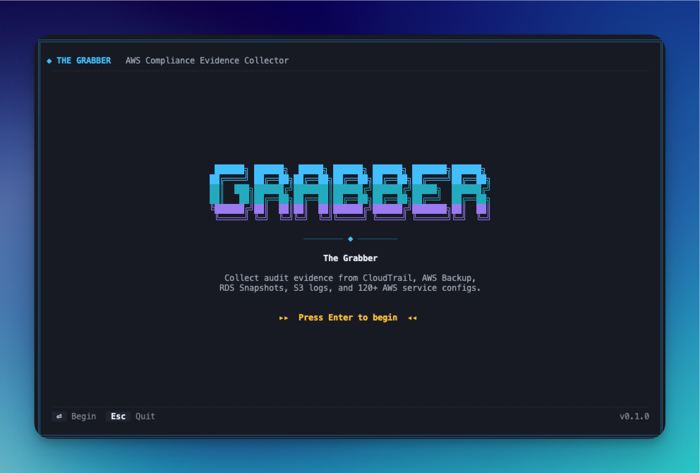
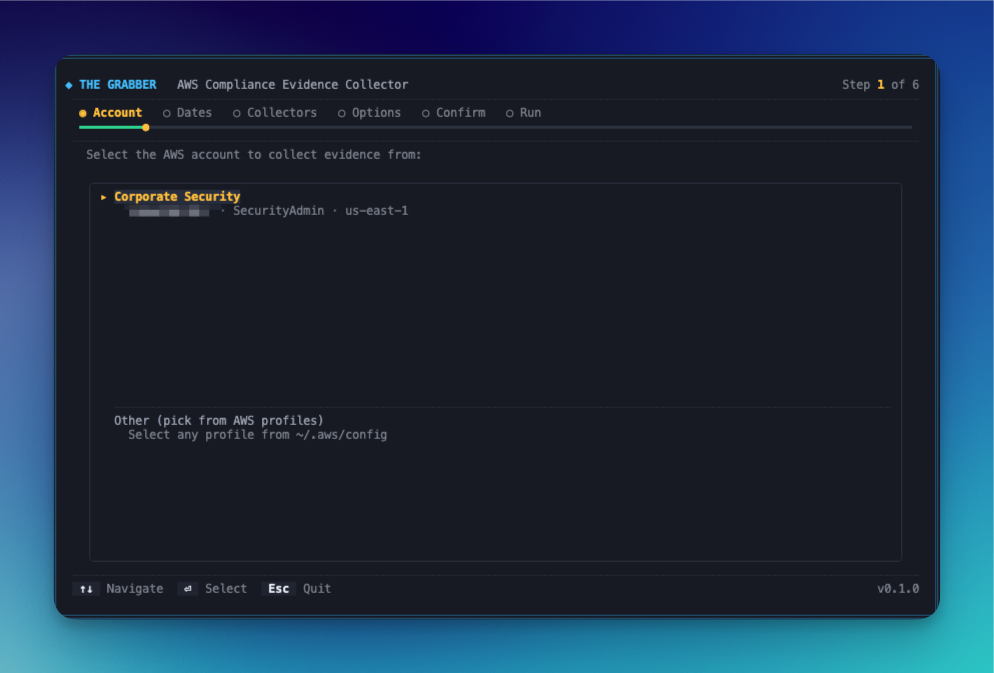
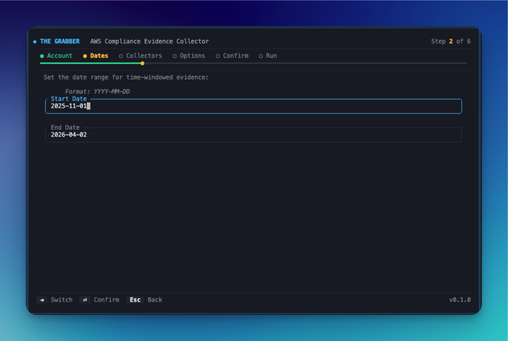
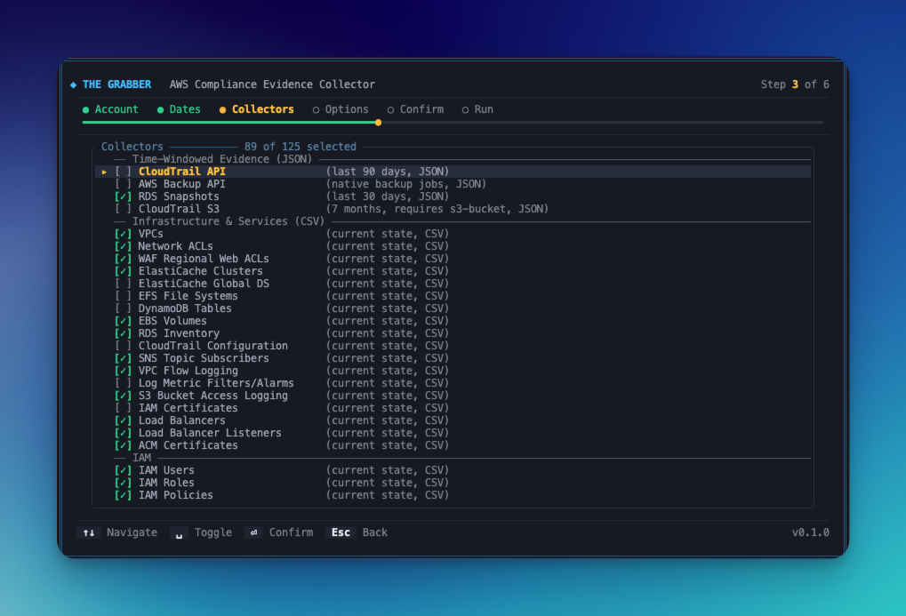
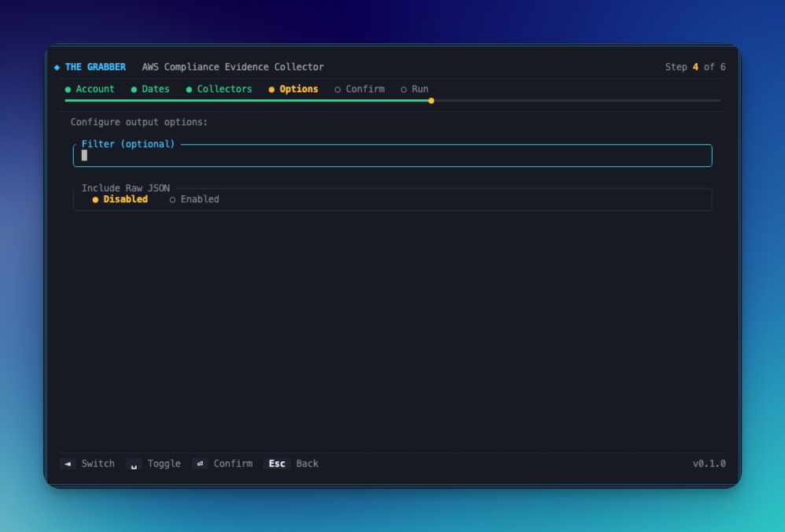
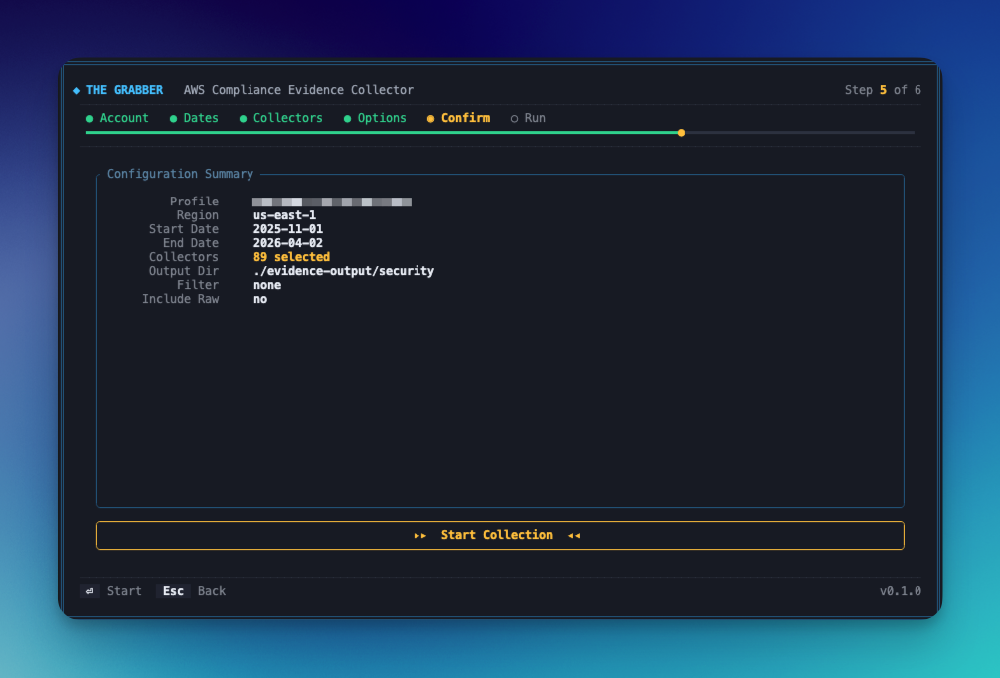
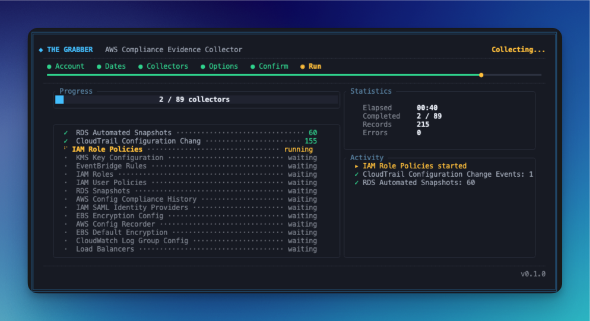

# The Grabber

An AWS compliance evidence collector with an interactive TUI and CLI mode. Collects current-state snapshots and time-windowed audit records from 124 AWS service APIs and writes them as CSV and JSON files — suitable for FedRAMP, SOC 2, HIPAA, or internal audit submissions.

---

## Features

- **Interactive TUI** — wizard-style interface for selecting accounts, date ranges, collectors, and options
- **Multi-account support** — TOML config drives an account picker; each account maps to an AWS SSO profile
- **124 collectors** — IAM, EC2, S3, RDS, CloudTrail, GuardDuty, SecurityHub, SSM, KMS, WAF, and more
- **Dual output formats** — structured JSON (inventory/policy data) and CSV (tabular snapshots)
- **Chain-of-custody audit trail** — per-run `CHAIN-OF-CUSTODY-*.json` and an append-only `CHAIN-OF-CUSTODY.jsonl` log capture operator identity, hostname, AWS caller ARN, and the sanitized CLI invocation
- **Run manifest** — `RUN-MANIFEST-*.json` records every collector's outcome (success/empty/error/timeout), record count, and file size
- **Zip bundling** — `--zip` packages all output files into a single `Evidence-<timestamp>.zip`
- **HMAC-SHA256 signing** — `--sign` generates a cryptographic manifest over every output file for tamper detection
- **Per-collector timeouts** — collectors that hang are cancelled after 3 minutes and collection continues
- **Clean TUI output** — all WARN messages are captured to `evidence-collection.log` so the terminal stays readable
- **Non-interactive CLI** — pass flags directly for scripted/CI use

---

## Requirements

- Rust 1.75 or later (`rustup update stable`)
- AWS CLI v2 with configured SSO or credential profiles
- IAM permissions for the services you want to collect (see [IAM Permissions](#iam-permissions))

---

## Configuration

Create `config.toml`:

```toml
[defaults]
region                 = "us-east-1"
output_dir             = "./evidence-output"
start_date_offset_days = 90      # start date = today minus N days
include_raw            = false

[defaults.collectors]
disable = [
    "s3",                # requires --s3-bucket flag
    "macie",             # optional service
    "scp",               # requires org admin role
    "org-config",        # requires org master account
]

[[account]]
name        = "Production"
account_id  = "123456789012"
profile     = "ProdAdmin-123456789012"   # must match a profile in ~/.aws/config
region      = "us-east-1"
output_dir  = "./evidence-output/production"

[[account]]
name        = "Operations"
account_id  = "098765432109"
profile     = "OpsAdmin-098765432109"
region      = "us-east-1"
output_dir  = "./evidence-output/operations"

# Master account — add org-level collectors
[[account]]
name        = "Master"
account_id  = "111122223333"
profile     = "MasterAdmin-111122223333"
region      = "us-east-1"
output_dir  = "./evidence-output/master"

[account.collectors]
enable_extra = ["scp", "org-config"]
```

The `name` field becomes the prefix on every output file (e.g. `Production_IAM_Roles-2026-04-01-120000.json`).

### Collector resolution order

For each account, the active collector set is resolved as follows:

1. If `enable` is set → run **only** those collectors (exclusive list)
2. Otherwise: start with all defaults, remove any in `disable`, then add any in `enable_extra`

This lets you lock an account to a minimal set, opt out of expensive collectors, or layer on org-level collectors without duplicating the full default list.

Profile names must exactly match entries in `~/.aws/config`. To find your profile names:

```bash
aws configure list-profiles
```

---

## AWS SSO Login

Authenticate before running:

```bash
# Login to your SSO session (session name is in ~/.aws/config)
aws sso login --sso-session <session-name>

# Verify a profile works
aws sts get-caller-identity --profile <profile-name>
```

To add a new profile for an account/role you have access to, add a block to `~/.aws/config`:

```ini
[profile RoleName-AccountId]
sso_session   = <session-name>
sso_account_id = 123456789012
sso_role_name  = RoleName
region         = us-east-1
```

---

## Usage

### Interactive TUI (recommended)

The binary must be built before running. From the repo root:

```bash
# Build once (output: target/release/grabber)
cargo build --release

# Run directly
./target/release/grabber

# Or install to PATH
cargo install --path .
grabber
```





The wizard walks through six steps:

---

### Account

Displays every `[[account]]` block from your `config.toml` as a selectable list. Each row shows the account name, account ID, AWS profile, and region.

Navigate with `↑`/`↓` and press `Enter` to select. Selecting an account:

- Sets the AWS profile, region, and output directory from that account's config block.
- Applies any per-account collector overrides (`enable`, `disable`, `enable_extra`) before you reach the Collectors step — so the collector list is already filtered for that account.

An **Other** option at the bottom falls back to a manual profile/region picker if the account is not in config.




---

### Dates

Two text fields: **Start Date** and **End Date** (format: `YYYY-MM-DD`).

`Tab` switches between fields and clears the newly focused field so you type fresh. `Ctrl+U` clears the current field. Dates are validated on `Enter` — an invalid format shows an inline error and does not advance.

These dates bound all time-windowed collectors (CloudTrail events, Backup job history, RDS backup events, etc.). Snapshot collectors (IAM, EC2, S3, etc.) run at the current moment regardless.





---

### Collectors

A scrollable checklist of 120+ collectors grouped into categories (IAM, EC2/Networking, Storage, RDS, KMS, CloudTrail, Config, Security Services, SSM, Monitoring, Containers, etc.).

- `Space` toggles the collector under the cursor.
- The title shows **X of Y selected** as you make changes.
- Per-account `disable` and `enable_extra` overrides from `config.toml` are already applied — disabled collectors are pre-unchecked and extra collectors are pre-checked.
- At least one collector must be selected to advance.





---

### Options

Two settings:

| Setting | Description |
|---------|-------------|
| **Output Dir** | Read-only — sourced from the selected account's `output_dir` in config. |
| **Include Raw** | Toggle (`Space`) between **Disabled** and **Enabled**. When enabled, the full raw AWS API response is embedded inside each JSON evidence record. Off by default. |

`Tab` moves between fields.



---

### Confirm

A summary screen showing all selected settings before anything runs:

- Profile, Region, Start Date, End Date
- Number of collectors selected
- Output directory, Include Raw setting

Press `Enter` (or the **▸▸ Start Collection ◂◂** button) to begin. No AWS calls have been made up to this point.





---

### Run

Collection executes all selected collectors concurrently. The screen shows:

- **Progress bar** — `X / Y collectors` complete.
- **Collector list** — each entry shows a live status icon: `·` waiting, spinner running, `✓` done with record count, `✗` failed with error message.
- **Stats card** — elapsed time, completed count, total records collected, error count.
- **Activity log** — reverse-chronological feed of the last 20 collector events (started / finished / failed).

Each collector has a **3-minute timeout** — if it hangs it is cancelled and collection continues. All `WARN`-level messages are written to `evidence-collection.log` in the output directory so the terminal stays readable.

When all collectors finish, the **Results** screen shows a success banner, total file count, total record count, and the full list of output file paths written.




## Non-interactive CLI

```bash
grabber \
  --start-date 2026-01-01 \
  --end-date   2026-04-01 \
  --region     us-east-1 \
  --profile    ProdAdmin-123456789012
```

Passing `--start-date` bypasses the TUI entirely. All other flags are optional and fall back to defaults.

## CLI Options

| Flag | Default | Description |
|------|---------|-------------|
| `--start-date` | *(required for CLI)* | Start of collection window (YYYY-MM-DD). Omitting launches the TUI. |
| `--end-date` | today | End of collection window (YYYY-MM-DD) |
| `--region` | `us-east-1` | AWS region |
| `--profile` | default | AWS named profile |
| `--collectors` | all defaults | Comma-separated collector keys to run |
| `--include-raw` | off | Embed full raw AWS API response in each JSON record |
| `--all-regions` | off | Collect from every enabled AWS region (round-robin) |
| `--regions` | — | Explicit comma-separated region list |
| `--s3-bucket` | — | S3 bucket containing CloudTrail logs |
| `--s3-prefix` | `""` | Key prefix before `AWSLogs/` in the bucket |
| `--s3-profile` | — | AWS profile for S3 access (cross-account CloudTrail) |
| `--s3-accounts` | — | Additional account IDs for S3 log collection |
| `--s3-regions` | — | Additional regions for S3 log collection |
| `--zip` | off | Bundle all output files into `Evidence-<timestamp>.zip` |
| `--sign` | off | HMAC-SHA256 sign all files; writes a manifest and key file |
| `--signing-key` | auto-generated | 64-char hex key to use instead of auto-generating |
| `--verify-manifest` | — | Verify a `SIGNING-MANIFEST-*.json` (runs verification only, no collection) |

---

## Output Files

Files are written to the configured output directory. Filenames follow the pattern:

```
<AccountName>_<CollectorName>-<YYYY-MM-DD-HHmmss>.<csv|json>
```

Example:
```
evidence-output/production/
  Production_IAM_Roles-2026-04-01-120000.json
  Production_IAM_Users-2026-04-01-120000.csv
  Production_KMS_Key_Configuration-2026-04-01-120000.json
  Production_SecurityHub_Findings-2026-04-01-120000.csv
  ...
  RUN-MANIFEST-<run_id>.json        ← per-run outcome record
  CHAIN-OF-CUSTODY-<run_id>.json    ← immutable per-run audit entry
  CHAIN-OF-CUSTODY.jsonl            ← append-only log of all runs
  evidence-collection.log           ← WARN messages from all collectors
```

### JSON envelope

JSON files (inventory/policy data) include a metadata envelope:

```json
{
  "collected_at": "2026-04-01T12:00:00Z",
  "account_id": "Production",
  "region": "us-east-1",
  "collector": "IAM Roles",
  "record_count": 42,
  "records": [ ... ]
}
```

### Run manifest

`RUN-MANIFEST-<run_id>.json` records the outcome of every collector in the run:

```json
{
  "run_id": "abc123",
  "tool_version": "0.1.0",
  "account_id": "123456789012",
  "region": "us-east-1",
  "collection_window": { "start": "2026-01-01", "end": "2026-04-01" },
  "summary": {
    "succeeded": 118,
    "empty": 4,
    "failed": 1,
    "timed_out": 1,
    "total_files": 120,
    "total_records": 84321
  },
  "collectors": [
    {
      "name": "IAM Roles",
      "status": "Success",
      "record_count": 42,
      "filename": "Production_IAM_Roles-2026-04-01-120000.json",
      "file_size_bytes": 15892
    }
  ]
}
```

### Chain of custody

`CHAIN-OF-CUSTODY-<run_id>.json` is written once per run and captures who ran it, from where, and with which AWS identity:

```json
{
  "run_id": "abc123",
  "operator": "jsmith",
  "hostname": "laptop-001.example.com",
  "local_ip": "10.0.1.50",
  "aws_identity": {
    "account_id": "123456789012",
    "caller_arn": "arn:aws:sts::123456789012:assumed-role/AuditRole/jsmith",
    "user_id": "AROA..."
  },
  "profile": "ProdAdmin-123456789012",
  "region": "us-east-1",
  "cli_invocation": "grabber --start-date 2026-01-01 --profile ProdAdmin-123456789012",
  "started_at": "2026-04-01T12:00:00Z"
}
```

`CHAIN-OF-CUSTODY.jsonl` accumulates one entry per run in NDJSON format, providing a persistent audit log across all collection runs against an output directory. Signing keys are automatically redacted from the stored CLI invocation.

### Zip and signing

When `--zip` is passed, all output files (evidence, manifest, chain-of-custody) are bundled into `Evidence-<timestamp>.zip` after collection completes.

When `--sign` is passed, an HMAC-SHA256 digest is computed for every output file and written to `SIGNING-MANIFEST-<run_id>.json` alongside a `SIGNING-KEY-<run_id>.txt`. The manifest can be verified later with `--verify-manifest`.

---

## Collectors

### Time-windowed (query a date range)

| Key | Description |
|-----|-------------|
| `cloudtrail` | CloudTrail management events |
| `s3` | CloudTrail S3 data events (requires `--s3-bucket`) |
| `backup` | AWS Backup job records |
| `rds` | RDS automated backup events |

### IAM

| Key | Output | Description |
|-----|--------|-------------|
| `iam-users` | CSV | Users with MFA status, last login, key status |
| `iam-roles` | JSON | Roles with trust policies and attached policies |
| `iam-policies` | CSV | Customer-managed policies with permissions summary |
| `iam-access-keys` | CSV | Access keys with status and last-used date |
| `iam-role-policies` | JSON | Role inline and attached policies |
| `iam-user-policies` | JSON | User inline, attached policies, permissions boundary |
| `iam-trusts` | CSV | Cross-account and service trust relationships |
| `iam-certs` | CSV | Server certificates |
| `iam-password-policy` | CSV | Account password policy |
| `iam-account-summary` | CSV | Account-level IAM summary |
| `saml-providers` | CSV | SAML identity provider configs |
| `access-analyzer` | CSV | IAM Access Analyzer findings |

### EC2 / Networking

| Key | Output | Description |
|-----|--------|-------------|
| `ec2-instances` | CSV | Instance inventory |
| `ec2-detailed` | CSV | Detailed instance config |
| `ec2-config` | CSV | Instance-level config settings |
| `vpc` | CSV | VPC configuration |
| `vpc-config` | CSV | VPC attributes |
| `vpc-flow-logs` | CSV | VPC flow log settings |
| `vpc-endpoints` | CSV | VPC endpoint inventory |
| `nacl` | CSV | Network ACL rules |
| `security-groups` | CSV | Security group rules |
| `sg-config` | CSV | Security group config details |
| `route-tables` | CSV | Route table entries |
| `rt-config` | CSV | Route table configuration |
| `igw` | CSV | Internet gateways |
| `nat-gateways` | CSV | NAT gateways |
| `launch-templates` | CSV | EC2 launch templates |
| `ebs` | CSV | EBS volume inventory |
| `ebs-config` | CSV | EBS volume configuration |
| `ebs-encryption` | CSV | EBS default encryption settings |

### Storage

| Key | Output | Description |
|-----|--------|-------------|
| `s3-config` | CSV | S3 bucket configuration |
| `s3-logging` | CSV | S3 access logging settings |
| `s3-logging-config` | CSV | S3 logging configuration detail |
| `s3-encryption` | CSV | S3 bucket encryption settings |
| `s3-public-access` | CSV | S3 public access block settings |
| `s3-policies` | CSV | S3 bucket policies |
| `s3-bucket-policy` | CSV | S3 bucket policy detail |
| `s3-data-events` | CSV | S3 CloudTrail data event selectors |
| `efs` | CSV | EFS file systems |
| `dynamodb` | CSV | DynamoDB tables |

### RDS

| Key | Output | Description |
|-----|--------|-------------|
| `rds-inventory` | CSV | RDS instance inventory |
| `rds-snapshots` | CSV | Automated and manual snapshots |
| `rds-backup-config` | CSV | Backup retention and window settings |

### KMS

| Key | Output | Description |
|-----|--------|-------------|
| `kms` | CSV | KMS key inventory |
| `kms-config` | JSON | Key configuration with full key policy |
| `kms-policies` | CSV | Key policies summary |

### CloudTrail

| Key | Output | Description |
|-----|--------|-------------|
| `cloudtrail-config` | CSV | Trail inventory |
| `ct-selectors` | CSV | Event selector configuration |
| `ct-validation` | CSV | Log file validation settings |
| `ct-s3-policy` | CSV | S3 bucket policies for trails |
| `ct-full-config` | CSV | Full trail configuration |
| `ct-changes` | CSV | CloudTrail change events |
| `ct-config-changes` | JSON | Config-related CloudTrail events |
| `ct-iam-changes` | CSV | IAM-related CloudTrail events |

### AWS Config

| Key | Output | Description |
|-----|--------|-------------|
| `config-rules` | CSV | Config rules and compliance status |
| `config-history` | CSV | Config change history |
| `config-timeline` | CSV | Resource configuration timeline |
| `config-compliance` | CSV | Compliance history |
| `config-snapshot` | CSV | Config snapshot summary |
| `config-recorder` | CSV | Configuration recorder settings |

### Security Services

| Key | Output | Description |
|-----|--------|-------------|
| `guardduty` | CSV | GuardDuty findings |
| `guardduty-config` | CSV | GuardDuty detector configuration |
| `guardduty-rules` | CSV | GuardDuty suppression rules |
| `gd-full-config` | CSV | Full GuardDuty configuration |
| `securityhub` | CSV | Security Hub findings |
| `sh-standards` | CSV | Enabled Security Hub standards |
| `sh-config` | CSV | Security Hub configuration |
| `securityhub-standards` | CSV | Security Hub standard controls |
| `macie` | CSV | Macie findings (if enabled) |
| `inspector` | CSV | Inspector findings |
| `inspector-config` | CSV | Inspector configuration |
| `inspector-history` | CSV | Inspector findings history |
| `access-analyzer` | CSV | IAM Access Analyzer findings |
| `public-resources` | CSV | Publicly accessible resources |

### SSM / Patch Management

| Key | Output | Description |
|-----|--------|-------------|
| `ssm-patches` | CSV | SSM patch compliance |
| `ssm-patch-summary` | CSV | Patch compliance summary |
| `ssm-patch-detail` | CSV | Per-instance patch detail |
| `ssm-patch-exec` | CSV | Patch execution history |
| `ssm-baselines` | CSV | Patch baselines |
| `ssm-maint-windows` | CSV | Maintenance windows |
| `ssm-instances` | CSV | Managed instance inventory |
| `ssm-params` | CSV | Parameter Store entries |
| `time-sync` | CSV | EC2 time synchronization config |

### Monitoring / Alerting

| Key | Output | Description |
|-----|--------|-------------|
| `cw-alarms` | CSV | CloudWatch alarms |
| `cw-log-groups` | CSV | CloudWatch log groups |
| `cw-config-alarms` | CSV | Config-related CloudWatch alarms |
| `cw-log-config` | CSV | Log group configuration |
| `metric-filters` | CSV | Metric filter alarm mappings |
| `metric-filter-config` | CSV | Metric filter configuration |
| `change-event-rules` | CSV | EventBridge change event rules |
| `eventbridge-rules` | JSON | EventBridge rule configuration |

### Compute / Containers

| Key | Output | Description |
|-----|--------|-------------|
| `ecs` | CSV | ECS cluster inventory |
| `eks` | CSV | EKS cluster inventory |
| `ecr-scan` | CSV | ECR image scan findings |
| `ecr-config` | CSV | ECR repository configuration |
| `lambda-config` | CSV | Lambda function configuration |
| `lambda-permissions` | CSV | Lambda resource-based policies |
| `asg` | CSV | Auto Scaling groups |

### Other Services

| Key | Output | Description |
|-----|--------|-------------|
| `acm` | CSV | ACM certificates |
| `elb` | CSV | Load balancer inventory |
| `elb-listeners` | CSV | Load balancer listener rules |
| `elb-full-config` | CSV | Full load balancer configuration |
| `alb-logs` | CSV | ALB access log settings |
| `sns` | CSV | SNS topic subscriptions |
| `sns-policies` | CSV | SNS topic policies |
| `secrets` | CSV | Secrets Manager secrets |
| `secrets-policies` | CSV | Secrets Manager resource policies |
| `cloudfront` | CSV | CloudFront distributions |
| `api-gateway` | CSV | API Gateway inventory |
| `backup-plans` | CSV | AWS Backup plans |
| `backup-vaults` | CSV | AWS Backup vaults |
| `route53-zones` | CSV | Route 53 hosted zones |
| `route53-resolver` | CSV | Route 53 Resolver rules |
| `waf` | CSV | WAF web ACLs |
| `waf-config` | CSV | WAF configuration |
| `waf-logging` | CSV | WAF logging configuration |
| `elasticache` | CSV | ElastiCache clusters |
| `elasticache-global` | CSV | ElastiCache global datastores |
| `cfn-drift` | CSV | CloudFormation stack drift |
| `resource-tags` | CSV | Resource tagging inventory |
| `account-contacts` | CSV | Account alternate contacts |
| `scp` | CSV | Service Control Policies (org admin required) |
| `org-config` | CSV | Organization configuration (master account required) |

---

## IAM Permissions

The collecting identity needs read-only access to the services it queries. A minimal policy covering all collectors:

```json
{
  "Version": "2012-10-17",
  "Statement": [
    {
      "Effect": "Allow",
      "Action": [
        "access-analyzer:List*",
        "acm:List*", "acm:Describe*",
        "autoscaling:Describe*",
        "backup:List*", "backup:Describe*", "backup:Get*",
        "cloudformation:Describe*", "cloudformation:List*", "cloudformation:Detect*",
        "cloudfront:List*", "cloudfront:Get*",
        "cloudtrail:Describe*", "cloudtrail:Get*", "cloudtrail:List*", "cloudtrail:LookupEvents",
        "cloudwatch:Describe*", "cloudwatch:List*", "cloudwatch:Get*",
        "config:Describe*", "config:Get*", "config:List*", "config:Select*",
        "dynamodb:List*", "dynamodb:Describe*",
        "ec2:Describe*",
        "ecr:Describe*", "ecr:List*", "ecr:Get*",
        "ecs:List*", "ecs:Describe*",
        "efs:Describe*",
        "eks:List*", "eks:Describe*",
        "elasticache:Describe*",
        "elasticloadbalancing:Describe*",
        "guardduty:List*", "guardduty:Get*",
        "iam:List*", "iam:Get*", "iam:GenerateCredentialReport",
        "inspector2:List*", "inspector2:Get*",
        "kms:List*", "kms:Describe*", "kms:Get*",
        "lambda:List*", "lambda:Get*",
        "logs:Describe*", "logs:List*",
        "macie2:List*", "macie2:Get*",
        "organizations:List*", "organizations:Describe*",
        "rds:Describe*", "rds:List*",
        "route53:List*", "route53:Get*",
        "route53resolver:List*",
        "s3:List*", "s3:Get*",
        "secretsmanager:List*", "secretsmanager:Get*",
        "securityhub:Describe*", "securityhub:Get*", "securityhub:List*",
        "sns:List*", "sns:Get*",
        "ssm:Describe*", "ssm:List*", "ssm:Get*",
        "sts:GetCallerIdentity",
        "tag:Get*",
        "wafv2:List*", "wafv2:Get*"
      ],
      "Resource": "*"
    }
  ]
}
```

---

## Troubleshooting

**SSO token expired**
```bash
aws sso login --sso-session <session-name>
```

**Profile not found**
```bash
aws configure list-profiles   # see available profiles
aws configure sso             # add a new profile interactively
```

**Files created but empty / `dispatch failure` in log**
The SSO session expired mid-run or the profile lacks permissions. Re-authenticate and verify:
```bash
aws sts get-caller-identity --profile <profile-name>
```

**Collector hangs**
Each collector has a 3-minute timeout. If a collector consistently times out, disable it in `config.toml`:
```toml
[defaults.collectors]
disable = ["guardduty", "inspector"]
```

**TUI shows 0 files**
The output directory may not exist — it is created automatically on first run. Check that `output_dir` in `config.toml` is a writable path.

**Stack overflow at startup**
The runtime uses 16MB thread stacks to accommodate the large number of concurrent async collectors. If you see stack overflows on a constrained system, reduce the number of selected collectors.
